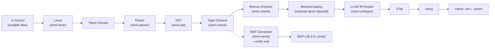

# XIOM Compiler Architecture

**Version:** v0.20.0 "Hardened"
**Date:** 2026-07-03
**Status:** Living document — updated as the compiler evolves

This document is the authoritative reference for understanding how the XIOM Rust compiler is structured, its data flow, current limitations, and what would need to change to support extreme-scale benchmarks (10K contracts, deep generics, 1000+ file projects). Every section is grounded in the three pillars defined in `specs/XIOM_Purpose.md`.

---

## 1. Overview & Three Pillars

The XIOM compiler (`xiomc`) is a multi-stage, single-pass compiler written in Rust. It takes `.xi` source files, produces LLVM IR text, and shells out to `clang` for final native or WASM binary emission. The compiler is currently in Phase 0 (Rust bootstrap) — it compiles a large subset of XIOM and is progressing toward self-hosting.

The compiler's architecture directly embodies the three pillars:

### SAFE — Memory safety without runtime overhead
- **Borrow checker** enforces lexical-scope ownership at compile time. References are tracked as read/write borrows that must not overlap with mutations. Variables leaving scope release their borrows deterministically.
- **No null types.** All optional values use `Option[T]` discriminated unions. The compiler emits discriminant checks at every use site.
- **Move semantics** are checked at the AST level — variables are marked consumed after being passed by value, and double-use is a compile error.

### VERIFIED — Contracts as compiler-enforced specification
- **Contract system** supports `requires`, `ensures`, and `invariant` clauses directly in function and type declarations.
- **Phase 1 (current):** Every contract clause emits a runtime guard block in LLVM IR. On violation, the program calls `@llvm.trap()`. Guards can be toggled via `--no-contracts`.
- **Phase 3 (planned):** Static verification via Z3 SMT solver. The `xiom-verify` crate already generates SMT-LIB 2.6 output via `--verify`. The contract is the specification — the compiler is the verifier.

### PRECISE — One canonical way to write each thing
- **LL(1) recursive descent parser** with no backtracking. The grammar has exactly one derivation per construct.
- **No implicit coercions.** There is no type widening, no implicit integer conversion, no silent truncation.
- **Exhaustive matching** is enforced on `match` statements with enums. Missing variants produce a compile error.
- **`derive`** generates boilerplate (`Eq`, `Clone`, `Display`, `Hash`, `Ord`) mechanically, ensuring correct-by-construction implementations that humans and AI would otherwise get wrong.

---

## 2. Pipeline Architecture

The compiler processes source through six sequential stages. Each stage consumes the output of the previous stage and transforms it.



### Stage Descriptions

| Stage | Crate | Input | Output | Key Activity |
|-------|-------|-------|--------|--------------|
| **Lex** | `xiom-lexer` | UTF-8 source string | `Vec<Token>` | Tokenizes source into a flat token stream. Handles keywords, literals, operators, comments. |
| **Parse** | `xiom-parser` | `Vec<Token>` | `Program` (AST) | Recursive-descent parser producing a typed AST. Merges multi-file programs by module name. |
| **Check** | `xiom-check` | `Program` | Type-validated `Program` + errors | Registers type/function declarations, resolves imports/module paths, type-checks all expressions and statements. Populates `ModuleCatalog` for external `.xi` files. |
| **Borrow Check** | `xiom-check` | `Program` | Borrow validation + warnings | Tracks ownership with lexical scopes. Detects use-after-move, double-borrow, and mutation-during-borrow. |
| **Codegen** | `xiom-codegen` | `Program` | LLVM IR string | Walks the AST, emits text LLVM IR. Handles struct layout, contract guards, generic monomorphisation, derive impls, and runtime extern declarations. |
| **SMT Verify** | `xiom-verify` | `Program` | SMT-LIB 2.6 string | Optional pass triggered by `--verify`. Translates contracts to SMT assertions for Z3. |

### Multi-File Flow

The `xiomc` binary (in `crates/xiomc/src/main.rs`) orchestrates the full pipeline:

1. **Resolve sources** — parses CLI arguments. Can accept a single `.xi` file, multiple `.xi` files, or a directory with a `package.xi` manifest.
2. **Lex + Parse** each source file independently, producing one `Program` per file.
3. **Merge** all programs into a single `Program` by folding same-named `ModuleDecl` items together (`merge_programs` at `main.rs:100`).
4. **Type Check** the merged program. The `Checker` also lazily loads external modules via `ModuleCatalog` when it encounters `use` declarations referencing modules not present in the merged program.
5. **Borrow Check** emits warnings (non-fatal during hardening).
6. **Inject external decls** — `collect_external_decls` pushes lazily-loaded type/function definitions into the program so codegen sees them.
7. **Codegen** emits LLVM IR text, monomorphises generics, and writes derives.
8. **Compile** via `clang` to native or WASM.

---

## 3. Crate-by-Crate Architecture

### 3.1 `xiom-ast` — Abstract Syntax Tree

**Purpose:** Defines every node in the XIOM grammar as Rust types. This is the single source of truth consumed by parser, checker, and codegen.

**Key Types:**

| Type | Purpose |
|------|---------|
| `Span` (line:16) | 1-based line/column position for every node |
| `Ident` (line:38) | A name + its source location |
| `Type` (line:54) | All 13 type constructors: `Named`, `Ref`, `MutRef`, `Option`, `Result`, `Vec`, `Slice`, `Map`, `Set`, `Tuple`, `Ptr`, `Array`, `Fn` |
| `Expr` (line:101) | 30 expression variants covering the entire grammar |
| `Stmt` (line:248) | 11 statement variants: `Let`, `Var`, `Assign`, `Return`, `Expr`, `If`, `Match`, `While`, `For`, `Spawn`, `Destructure` |
| `Pattern` (line:224) | Match patterns: `Wildcard`, `Ident`, `Variant`, `Lit`, `Some`, `None`, `Ok`, `Err` |
| `FnDecl` (line:334) | Complete function declaration including generics, contracts, receiver, and optional body |
| `TypeDecl` (line:383) | Struct declaration with fields, derives, invariants, and type alias support |
| `EnumDecl` (line:407) | Enum with variants, each having typed fields |
| `ModuleDecl` (line:456) | Module with path, items, file-level flag, and source file reference |
| `TopDecl` (line:470) | Union of all top-level declarations |
| `Program` (line:484) | Root: `items: Vec<TopDecl>`, `source_files`, `root_dir` |

**Size:** 496 lines. Stable and mature.

**Known Limitations:**
- `Int` literal is `u64` only — no negative integer literals in the AST (negation is a unary op).
- `Char` is `char` (4 bytes) but codegen treats it as `i8`. This mismatch exists across the pipeline.
- No dedicated `Span` for synthesized/internal nodes (uses `Span::new(0,0)` as placeholder).

---

### 3.2 `xiom-lexer` — Tokenizer

**Purpose:** Converts UTF-8 source text into a flat `Vec<Token>`. Handles all lexical rules from Section 3.1 of the language spec.

**Key Types:**

| Type | Purpose |
|------|---------|
| `TokenKind` (line:15) | 47 variants: 26 keywords, 5 literals, 24 operators/punctuation, `Eof`, `Error` |
| `Token` (line:49) | `kind`, `span`, `lexeme` (the raw source text) |
| `Lexer` (line:70) | State machine over `source: Vec<char>` with `pos`, `line`, `col` |

**Key Method:**
- `tokenize()` → `Vec<Token>` — single-pass, consumes the entire source.

**Size:** 503 lines. Simple and stable.

**Known Limitations:** String escape sequences are minimal (`\n`, `\t`, `\r`, `\\`, `\"`, `\u{...}`). Complex Unicode escapes and raw string literals are not yet supported.

---

### 3.3 `xiom-parser` — Recursive Descent Parser

**Purpose:** Converts the token stream into a typed AST. Implements the full EBNF grammar. LL(1), no backtracking.

**Key Struct:**
```rust
pub struct Parser {
    tokens: Vec<Token>,
    pos: usize,
}
```

**Key Methods:**

| Method | Purpose |
|--------|---------|
| `parse_program()` | Entry point. Optionally parses `module a.b.c` header, then loops on `parse_top_decl()` |
| `parse_top_decl()` | Dispatches on keyword: `fn` → `parse_fn()`, `type` → `parse_type_decl()`, `enum` → `parse_enum_decl()`, etc. |
| `parse_expr()` | Pratt-style expression parser with operator precedence |
| `parse_stmt()` | Statement parser: `let`, `var`, `return`, `if`, `match`, `while`, `for`, etc. |
| `parse_pattern()` | Match arm pattern parser |
| `parse_type()` | Type annotation parser |

**Data Flow:**
- **Consumes:** `Vec<Token>` (from lexer)
- **Produces:** `Result<Program, ParseError>`

**Size:** 1931 lines. Large but well-organized.

**Known Limitations:**
- No error recovery — the first parse error terminates the compile.
- `parse_file_module_header()` parses a leading `module a.b.c;` but if the module declaration appears after imports or comments, detection fails silently.
- Binary operator precedence is hardcoded (no table-driven approach), making precedence changes fragile.

---

### 3.4 `xiom-check` — Type Checker + Module Catalog + Borrow Checker

**Purpose:** The largest and most complex crate. Performs type checking, name resolution, module loading, and borrow checking in a single compilation unit.

**Key Structs:**

#### `Checker` (line:468)
```rust
pub struct Checker {
    types: HashMap<String, HashMap<String, CheckedType>>,   // type → fields
    functions: HashMap<String, FnSig>,                      // name → signature
    locals: Vec<HashMap<String, CheckedType>>,              // scoped variable map
    modules: HashMap<String, HashMap<String, ModuleExport>>, // module namespace
    methods: HashMap<String, HashMap<String, FnSig>>,       // type → methods
    enum_variants: HashMap<String, String>,                  // variant → parent enum
    imports: Vec<UseDecl>,                                   // use declarations
    source_dirs: Vec<String>,                                // search paths
    catalog: ModuleCatalog,                                  // lazy external module loader
    errors: Vec<CheckError>,
    visibility: HashMap<String, bool>,
}
```

#### `ModuleCatalog` (line:199)
```rust
pub struct ModuleCatalog {
    source_dirs: Vec<String>,
    cache: HashMap<String, CachedModule>,  // dotted_path → parsed file
}
```

#### `BorrowChecker` (line:2197)
```rust
pub struct BorrowChecker {
    ownership: Vec<HashMap<String, OwnershipInfo>>,  // scoped ownership tracking
    borrow_stack: Vec<Vec<ScopeBorrow>>,              // active borrows per scope
    errors: Vec<BorrowError>,
    param_names: HashSet<String>,
}
```

#### `CachedModule` (line:185)
Contains the parsed `Program`, type map, function map, and type field map for an externally loaded `.xi` file.

**Key Methods:**

| Method | Purpose |
|--------|---------|
| `Checker::check_program()` | Main entry point: registers types → registers function signatures → resolves imports → checks function bodies |
| `Checker::register_type_decl()` | Populates `self.types` with struct fields and enum variants |
| `Checker::register_fn_signature()` | Populates `self.functions` with param/return types |
| `Checker::check_top_decl()` | Dispatches to `check_fn()`, `check_type_decl()`, etc. |
| `Checker::check_expr()` | Type-checks an expression, returns the inferred `CheckedType` |
| `Checker::resolve_imports()` | Processes `use` declarations, loads external modules via `ModuleCatalog` |
| `Checker::collect_external_decls()` | Returns `Vec<TopDecl>` of pub types/enums/functions from cached external modules for injection before codegen |
| `ModuleCatalog::find_owned()` | Lazy-loads an external `.xi` file by dotted path, caches it |
| `ModuleCatalog::load_module()` | Tries path-based lookup, then scan-based fallback across `source_dirs` |
| `BorrowChecker::check_program()` | Walks all function bodies, tracks ownership/borrow state |

**Data Flow:**
- **Consumes:** `Program` (AST)
- **Produces:** Validated `Program` (mutated in-place), or `Vec<CheckError>`
- **Produces (for codegen):** `Vec<TopDecl>` of external declarations

**Size:** 3105 lines. The most complex crate. Contains type checking, import resolution, module loading, and borrow checking.

**Known Limitations:**
- Single-pass checker — no multi-phase type inference. Generic type parameters are tracked but not fully resolved (they pass through as `CheckedType::Generic`).
- `CheckedType` is a flat enum with no support for parametric types (e.g., `Vec[Int]` is just `Named("Vec")`). Type arguments are discarded.
- The `ModuleCatalog` scan fallback walks the entire source directory tree on every cache miss (`load_module` at line 236). For 1000+ files this becomes O(n*m) per lookup.
- Import resolution (`resolve_imports`) processes `use` declarations sequentially without dependency ordering.
- Method lookup searches by convention (receiver type prefix) rather than a formal method table.

---

### 3.5 `xiom-codegen` — LLVM IR Emitter

**Purpose:** Walks the AST and emits human-readable LLVM IR as text. No LLVM library dependency — pure string emission.

**Key Struct:**

```rust
pub struct IrEmitter {
    output: String,
    tmp_counter: u32,
    block_counter: u32,
    str_counter: u32,
    locals: Vec<HashMap<String, (String, String)>>,     // scoped variable → (reg, llvm_type)
    functions: HashMap<String, (Vec<String>, String)>,    // name → (param_types, ret_type)
    types: HashMap<String, Vec<String>>,                  // struct → field names
    type_meta: HashMap<String, TypeMeta>,                 // struct → (field_name, field_type)
    generic_fn_decls: Vec<FnDecl>,                        // stored for monomorphisation
    generic_instantiations: Vec<(String, Vec<String>)>,   // tracked instantiations
    interfaces: HashMap<String, Vec<(String, Vec<String>)>>,
    enum_variants: HashMap<String, Vec<(String, Vec<String>)>>,
    current_module: Option<String>,
    check_contracts: bool,
    target_triple: String,
    max_recursion_depth: u32,
    emitted_fns: HashSet<String>,
    // ... ~25 more fields
}
```

**Key Methods:**

| Method | Purpose |
|--------|---------|
| `compile_program()` | Entry point. Registers types, registers functions, emits struct definitions, emit declares, compiles function bodies, monomorphises generics, emits builtins, emits strings |
| `register_type_layout()` | Builds the `types` and `type_meta` maps for struct/enum layout |
| `register_functions()` | Records function signatures for later call resolution |
| `compile_fn()` | Emits a full function definition: alloca params, compile body, emit contract guards, emit return |
| `compile_expr()` | Recursively emits IR for an expression, returns the SSA register holding the result |
| `compile_stmt()` | Emits IR for a statement (let, var, return, if, match, while, for, etc.) |
| `compile_generic_monomorphisations()` | Iterates over tracked generic instantiations, clones function bodies with type substitutions, emits concrete versions |
| `compile_derive_impls()` | Generates `clone`, `eq`, `display`, `hash`, `ord` implementations for types with `derive` |
| `fn_symbol()` | Returns the LLVM symbol name for a function, qualifying with module name to avoid multi-file collisions |
| `fn_key()` | Computes the lookup key for a function (e.g., `TypeName.method` for methods, `fn_name` for free functions) |
| `compile_contract_guard()` | Emits a branch that calls `@llvm.trap()` if a contract condition fails |

**Data Flow:**
- **Consumes:** `Program` (AST, post-checker)
- **Produces:** `Result<String, String>` — the complete LLVM IR text

**Emitted LLVM IR Structure:**

```
; Module header
target triple = "x86_64-pc-windows-msvc"

; Struct type definitions
%struct.Point = type { i64, i64 }

; External declarations
declare i32 @printf(i8*, ...)
declare void @llvm.trap()
declare i8* @malloc(i64)

; Derive implementations (clone, eq, display, etc.)

; Function definitions
define i64 @add(i64 %param0, i64 %param1) {
entry:
  %tmp0 = add i64 %param0, %param1
  ret i64 %tmp0
}

; Monomorphised generic function bodies

; Builtin runtime implementations
```

**Size:** 3910 lines. The second-largest crate. Complex but well-factored.

**Known Limitations (from `docs/audits/benchmark_crash_audit.md`):**

| Issue | Severity | Status |
|-------|----------|--------|
| **Vec.push heap buffer overflow** — fixed 128-byte allocation, no realloc (V1) | CRITICAL | Open |
| **No recursion depth limit** — recursive calls can overflow stack (V2) | CRITICAL | Fixed (v0.20.0 — depth counter with `max_recursion_depth: 500`) |
| **Weak local variable hashing** — name collisions in C runtime (V3) | HIGH | Open |
| **Division by zero** — raw `sdiv`/`srem` with no guard (V4) | HIGH | Fixed (v0.20.0 — trap before div) |
| **Fixed-size C runtime arrays** — 16 fields, 64 locals, 16 match arms (V5) | HIGH | Open |
| **Generic monomorphisation infinite loop** — worklist with no iteration limit (V6) | MEDIUM | Open |
| **Unknown types → i64 silently** — `xiom_to_llvm_type` default case (V7) | MEDIUM | Open |
| **Text IR only** — no LLVM optimization passes applied | INFO | By design (Phase 0) |

---

### 3.6 `xiomc` — CLI Binary

**Purpose:** The `xiomc` executable that orchestrates the full pipeline: lex → parse → merge → check → borrow check → external decl injection → codegen → clang compile.

**Key Functions:**

| Function | Line | Purpose |
|----------|------|---------|
| `main()` | 30 | CLI orchestration: parses flags, resolves sources, runs all stages |
| `merge_programs()` | 100 | Merges multiple parsed `Program`s by folding same-named modules |
| `resolve_source_files()` | 387 | Parses CLI args to determine source files; handles single files, multi-files, directories, and `package.xi` manifests |
| `load_package_dir()` | 427 | Reads `package.xi` manifest to determine module load order |
| `scan_ax_files()` | 454 | Scans a directory for `.xi` files |
| `build_module_file_map()` | 472 | Maps module paths to file paths by reading `module` declarations |
| `dump_contracts_json()` | 853 | Serializes all contracts in the program to JSON (`--dump-contracts`) |
| `fn_signature_string()` | 809 | Formats a function signature for JSON output |

**Size:** 968 lines. Primarily orchestration and CLI parsing.

**CLI Flags:**

| Flag | Purpose |
|------|---------|
| `<source.xi>` | Primary source file (required) |
| `--emit-ir` | Print LLVM IR to stdout |
| `-o <output>` | Output binary path |
| `--target <target>` | `native`, `wasm`, `arm`, `riscv` |
| `--run` | Compile and run, print exit code |
| `--no-contracts` | Disable contract runtime checks |
| `--check-contracts` | Explicit contract checking |
| `--diagnostics=json` | JSON-structured compiler output |
| `--dump-contracts` | Print contract index as JSON |
| `--verify` | Generate SMT-LIB contract verification |
| `--verify-output <file>` | Write SMT-LIB to file |

**Supported Targets:**

| Target | Triple | Output | Notes |
|--------|--------|--------|-------|
| Native | `x86_64-pc-windows-msvc` | `.exe` | Links `xiom_runtime.c` |
| WASM | `wasm32-unknown-unknown` | `.wasm` | `-nostdlib`, exports all |
| ARM | `aarch64-unknown-linux-gnu` | `.out` | Cross-compile only |
| RISC-V | `riscv64gc-unknown-linux-gnu` | `.out` | Cross-compile only |

---

### 3.7 `xiom-verify` — SMT Contract Generator (Optional Pass)

**Purpose:** Translates function contracts (`requires`/`ensures`) and type invariants into SMT-LIB 2.6 format for offline verification with Z3.

**Key Struct:**

```rust
pub struct SMTGenerator {
    buf: String,
}
```

**Key Methods:**

| Method | Purpose |
|--------|---------|
| `generate()` | Entry point. Emits `(set-logic QF_NRA)`, declares params, emits assertions for `requires`, emits negated assertions for `ensures` (checking counterexamples) |
| `verify_function()` | For each contracted function: declares param constants, emits `(assert requires)`, pushes, asserts `(not ensures)`, calls `(check-sat)` |
| `translate_expr()` | Recursively translates XIOM expressions to SMT-LIB s-expressions |

**Data Flow:**
- **Consumes:** `Program` (AST)
- **Produces:** SMT-LIB 2.6 string (printed or written to file)

**Size:** 218 lines. Simple but functional.

**Known Limitations:**
- Uses `QF_NRA` (quantifier-free non-linear real arithmetic) which can be slow on complex contracts.
- No support for `@pre` (pre-state) expressions in SMT — the `@pre` operator is recognized but not semantically modeled.
- No Z3 integration at compile time — output must be manually fed to Z3.

---

## 4. Data Flow Deep Dive

Walking through the compilation of a simple function:

```xiom
fn add(a: Int, b: Int) -> Int {
    return a + b;
}
```

### Stage 1: Lexer

The lexer processes the source string character by character, producing tokens:

```
[Fn, Ident("add"), LParen, Ident("a"), Colon, Ident("Int"), Comma,
 Ident("b"), Colon, Ident("Int"), RParen, Arrow, Ident("Int"),
 LBrace, Return, Ident("a"), Plus, Ident("b"), Semicolon, RBrace, Eof]
```

Each token carries its `Span` (line:col) and `lexeme` (original source text).

### Stage 2: Parser

The parser reads the token stream and recognizes the `fn` keyword, then delegates to `parse_fn()`:

```
FnDecl {
    name: Ident("add", Span { line: 1, col: 4 }),
    generics: [],
    params: [
        Param { name: Ident("a", ...), ty: Type::Named(Ident("Int", ...), []) },
        Param { name: Ident("b", ...), ty: Type::Named(Ident("Int", ...), []) },
    ],
    return_type: Some(Type::Named(Ident("Int", ...), [])),
    contracts: [],
    body: Some(Block {
        stmts: [StmtOrExpr::Stmt(Stmt::Return(
            Some(Expr::Binary(
                Box::new(Expr::Ident(Ident("a", ...))),
                BinOp::Add,
                Box::new(Expr::Ident(Ident("b", ...))),
                ...
            )),
            ...
        ))],
    }),
    receiver: None,
    is_pub: false,
    is_async: false,
    span: Span { line: 1, col: 1 },
}
```

### Stage 3: Type Checker

The `Checker` processes the program in three sub-stages:

1. **Register types:** No user-defined types in this example, only builtins.
2. **Register function signatures:** Records `add` as `FnSig { params: [("a", Int), ("b", Int)], return_type: Some(Int) }`.
3. **Check function body:** Walks the `return` statement:
   - `Expr::Ident("a")` → looks up in `locals` → type `Int` (parameter) ✓
   - `Expr::Ident("b")` → looks up in `locals` → type `Int` (parameter) ✓
   - `BinOp::Add` on `(Int, Int)` → result type `Int` ✓
   - Return type `Int` matches declared return type `Int` ✓

No errors. The program is valid.

### Stage 4: Borrow Checker

No references or mutations in this function. The borrow checker scans the body and finds nothing to report. Passes silently.

### Stage 5: Codegen

The `IrEmitter` processes the function declaration:

1. **`register_functions`:** Records signature `add: (params: [i64, i64], ret: i64)`.
2. **`compile_fn`:** Emits:
   ```
   define i64 @add(i64 %param0, i64 %param1) {
   entry:
     %a = alloca i64
     store i64 %param0, i64* %a
     %b = alloca i64
     store i64 %param1, i64* %b
     %tmp0 = load i64, i64* %a
     %tmp1 = load i64, i64* %b
     %tmp2 = add i64 %tmp0, %tmp1
     ret i64 %tmp2
   }
   ```

### Stage 6: clang

If the user specified `--run` or `-o`, the IR is written to a temporary `.ll` file and `clang` compiles it to the target binary. Otherwise, the IR is printed to stdout.

---

## 5. Multi-File Module Resolution

The XIOM compiler supports three module patterns:

### 5.1 Inline Modules

```xiom
module Math {
    pub fn add(a: Int, b: Int) -> Int { return a + b; }
}
```

The parser produces a `TopDecl::Module(ModuleDecl { name: "Math", items: [FnDecl("add", ...)], is_file_level: false })`. The checker treats the module body as a nested scope with its own namespace.

### 5.2 File-Level Modules (Single File)

```xiom
module a.b.c;

fn greet() -> Str { return "hello"; }
```

The parser's `parse_file_module_header()` detects the leading `module a.b.c;` declaration and wraps all subsequent top-level declarations in a `ModuleDecl` with `is_file_level: true` and `path: ["a", "b", "c"]`. The module path becomes the namespace prefix for all contained items.

### 5.3 Multi-File Module Resolution (ModuleCatalog)

When the checker encounters a `use` declaration referencing a module not present in the current program:

```xiom
use benchmark.math;  // triggered by identifier "math" not in local scope
```

The resolution flow:

1. **Checker** calls `ModuleCatalog::find_owned(["benchmark", "math"])`.
2. **Strategy A (path-based):** tries `<source_dir>/benchmark/math.xi`, then `<source_dir>/benchmark.math.xi`, then `<source_dir>/math.xi` (matching the last segment via header verification).
3. **Strategy B (scan-based fallback):** walks all `.xi` files in `source_dirs` recursively, quick-parsing each file's `module` header to find a match.
4. On success, the file is fully parsed and cached as a `CachedModule` containing the parsed `Program`, type map, and function map.
5. **Checker** calls `register_external_module()` to merge the cached types and functions into its own tables.
6. **After borrow check**, `collect_external_decls()` gathers all cached external pub types/enums/functions and injects them as `TopDecl` items into the program so the codegen emits their definitions.

### 5.4 Collision-Free Naming (`fn_symbol`)

When multiple files define functions with the same bare name (e.g., two modules both have a `run()` function), the codegen's `fn_symbol()` method at `codegen/lib.rs:694` detects the collision via the `emitted_fns` set and qualifies subsequent definitions with their module prefix:

```llvm
; First definition (bare name, in benchmark/main.xi module)
define i64 @run() { ... }

; Second definition (module-qualified, in benchmark/math.xi module)
define i64 @math.run() { ... }
```

`main` is always emitted bare to serve as the LLVM entry point.

---

## 6. Current Limitations & Scalability Gaps

### 6.1 Ownership / Borrow System

**Current state:** Lexical-scope tracking with read/write borrow counts. References are detected at the expression level. No lifetime elision, no borrows in struct fields, no non-lexical lifetimes (NLL). The borrow checker emits warnings rather than errors during this hardening phase.

**Scalability:** Borrow checking is O(n) in the number of variables and borrow sites per function. For 10K borrows spread across 10K functions, performance is linear and acceptable. The limiting factor is not borrow count but the absence of struct-field borrows — any serious systems programming would need this.

**Future:** Full lifetime elision (Phase 2) would add O(n) annotation inference. Non-lexical lifetimes would require a control-flow graph, doubling the checker's complexity.

### 6.2 Contract System

**Current state:** Runtime guards only. Each `requires` clause emits an `icmp` + conditional branch to `@llvm.trap()`. Each `ensures` clause emits similar guards at every `return` point. A function with 5 contracts generates ~30-50 LLVM IR instructions of guard code.

**Scalability:**
- 10K contracts → ~50K-100K additional IR instructions. Compiles fine but binary size grows linearly.
- Runtime overhead: ~3-4 instructions per contract check at runtime. Acceptable for development/testing, heavy for production hot paths.
- **No verification at compile time.** Contracts catch violations at runtime only. A function with `requires x > 0` and a caller passing `x = -1` compiles successfully and traps at runtime.
- `@pre` (pre-state) is recognized syntactically but not semantically modeled — it compares against the runtime value at the point of the `ensures` check rather than the entry-point snapshot.

**Future:** Z3 static verification (Phase 3) would eliminate runtime overhead for statically-proven contracts. This requires: (1) translating the full XIOM type system to SMT theories, (2) modeling heap state for `@pre`, (3) handling loops with invariant annotations. Current `xiom-verify` generates SMT-LIB but does not integrate Z3 into the compile pipeline.

### 6.3 Generic Monomorphisation

**Current state:** Generic functions are stored in `generic_fn_decls` during registration. When a generic function is called with concrete types, the instantiation is tracked in `generic_instantiations`. After all non-generic codegen, `compile_generic_monomorphisations()` iterates the worklist, cloning the function body and substituting type parameters.

**Scalability:**
- ~20 instantiations: compiles in under a second.
- 100+ instantiations: compile time grows linearly. Each monomorphisation clones the full function AST and re-emits LLVM IR from scratch.
- **No deduplication** — identical instantiations of the same generic with the same concrete types produce duplicate IR. The `emitted_fns` set prevents duplicate emission, but the monomorphisation work still happens.
- **No iteration limit** — if a monomorphised function body contains a call that triggers another monomorphisation, the worklist grows unbounded (audit V6).

**Future:** Parallel monomorphisation across threads (each instantiation is independent). Dedup by hashing `(fn_name, concrete_types)` before cloning. Iteration limit (1000 by default).

### 6.4 Module System

**Current state:** `ModuleCatalog` lazily loads files. Path-based lookup tries 3 patterns per source directory. Scan-based fallback walks all directories recursively on every cache miss.

**Scalability:**
- 30 modules: sub-second resolution.
- 1000+ modules: scan-based fallback reads every `.xi` file header in every source directory. For N files and M lookups, worst case is O(N*M). The cache mitigates repeated lookups but cold-start resolution is expensive.
- **No incremental compilation.** Every `xiomc` invocation re-parses all files.

**Future:** Indexed lookup — build a `module_path → file_path` map on startup by scanning once, then resolve all lookups in O(1). File watcher + incremental recompilation for dev loops.

### 6.5 Codegen

**Current state:** Text IR emission. No optimization passes. The LLVM IR is emitted as strings and fed to `clang` as-is.

**Scalability:**
- **Vec.push reallocation (V1):** Fixed 128-byte allocation for Vec data. Any Vec exceeding 16 `i64` elements corrupts heap memory. This is a correctness bug, not a scalability concern — but it makes any non-trivial benchmark using Vec unsafe to run.
- **Recursion depth (V2 - fixed):** A `@xiom_recursion_counter` global is incremented at each call site, with `icmp` + trap at the configured limit (default 500). Safe for deep recursion.
- **Div-by-zero guard (V4 - fixed):** `icmp eq` + conditional branch to trap before every `sdiv`/`srem`. Safe.
- **C runtime limits (V5):** 16 struct fields, 64 local variables, 16 match arms. Programs exceeding these limits silently produce wrong IR. The benchmark suite's `BigStruct` (50 fields) triggers this.
- **String constant limit:** All string constants are collected in a `Vec<String>`. For programs with 10K+ string literals (unlikely in systems code), this would consume significant memory during compilation.
- **Type map lookup:** `llvm_type_for()` performs a linear scan of all `type_meta` keys when module-qualified lookup fails. For 1000+ types, this becomes O(n) per type resolution.

**Future:**
- Vec reallocation: add capacity check + `realloc` doubling strategy.
- C runtime limits: replace fixed arrays with dynamic allocation, or increase limits significantly (e.g., 256 fields, 1024 locals).
- Unknown types: remove the `_ => "i64"` default in `xiom_to_llvm_type()` and return an error.
- Optimization: emit LLVM IR with `opt` passes (at least `-O1`).
- Type map: use a prefix-trie or separate HashMap for module-qualified lookups.

### 6.6 Parser / Checker

**Current state:** LL(1) recursive descent (O(n) for n tokens). Single-pass checker. Both are linear in input size.

**Scalability:**
- 10K+ line single files: compiles successfully (verified with `benchmark_stress.xi` at 8,577 lines, 28 inline modules).
- **No incremental parsing.** On any change, the entire file is re-tokenized and re-parsed.
- **No error recovery.** The first parse or type error terminates the compile. For large projects, this means fixing one error at a time.

**Future:** Multi-pass type inference would require a second pass over the AST (approximately doubling check time for complex programs). Error recovery in the parser would allow reporting multiple errors per compile.

---

## 7. Improvement Roadmap

| Area | Current | Target | Effort | Priority |
|------|---------|--------|--------|----------|
| **Contract static verification** | Runtime guards only | Z3 SMT integration (Phase 3) | Large | P3 |
| **Borrow checker** | Lexical scope, no struct borrows | Full lifetime elision, struct-field borrows | Large | P2 |
| **Generic monomorphisation** | Sequential, no dedup | Parallel + dedup + iteration limit | Medium | P2 |
| **Codegen optimization** | Text IR only, no passes | LLVM opt passes (`-O1` minimum) | Medium | P2 |
| **Vec reallocation** | Fixed 128 bytes (16 elements) | Dynamic realloc with doubling strategy | Small | P1 |
| **Module catalog** | Lazy scan-based fallback | Indexed O(1) lookup | Small | P2 |
| **C runtime limits** | 16 fields / 64 locals / 16 arms | Dynamic arrays or 256/1024/256 limits | Medium | P2 |
| **WASM target** | Basic (`wasm32-unknown-unknown`) | Full WASI support | Medium | P3 |
| **FFI generation** | Manual `extern "C"` blocks | Mechanical binding generation from C headers | Large | P3 |
| **Error recovery** | Terminates on first error | Multi-error reporting | Medium | P2 |
| **Incremental compilation** | Full recompile every time | File watching + hot reload | Large | P3 |
| **Unknown type default** | `_ => "i64"` silently | Error on unknown types | Small | P1 |
| **Generic mono loop guard** | No iteration limit | Cap at 1000 iterations | Small | P1 |
| **LLVM IR verification** | None before clang | Run `opt -verify` pass | Small | P2 |

---

## 8. Performance Ceilings — Honest Assessment

### What the compiler CAN handle today

| Benchmark | Result | Notes |
|-----------|--------|-------|
| 10K+ line single files | Passes | `benchmark_stress.xi`: 8,577 lines, 28 inline modules |
| 30+ module multi-file projects | Passes | `benchmark/main.xi` with cross-module calls |
| 50-field structs | Fails (V5) | `BigStruct` in benchmark_extreme hits C runtime limit of 16 fields |
| Deep recursion | Passes (V2 fixed) | Depth counter traps at 500 by default |
| Tuple/struct return types | Passes | Tuples synthesised as anonymous structs |
| Generic monomorphisation at ~20 instantiations | Passes | Worklist processing completes |
| Contracts with runtime guards | Passes | Each contract emits guard block |
| Derive implementations | Passes | `clone`, `eq`, `display`, `hash`, `ord` generated mechanically |
| WASM target | Passes | Basic `wasm32-unknown-unknown` with `--export-all` |
| SMT-LIB generation | Passes | `--verify` produces valid SMT-LIB 2.6 |

### What would stress or break it

| Scenario | Bottleneck | Severity |
|----------|------------|----------|
| 1000+ module projects | ModuleCatalog scan fallback — O(N*M) file reads | High |
| 100+ generic instantiations | Monomorphisation time — sequential cloning + IR emit per instantiation | Medium |
| 10K contracts in one file | Binary size — 50K-100K additional guard instructions, not correctness | Low |
| 100+ field structs | C runtime V5 limit — 16 fields, truncation | High |
| 100+ local variables per function | C runtime V5 limit — 64 locals, truncation | High |
| Vec with 17+ elements | Heap buffer overflow (V1) — fixed 128-byte allocation | Critical |
| Unbounded generic chains | Infinite monomorphisation loop (V6) | Medium |
| Filesystem I/O at scale | No async I/O — all file reads are synchronous blocking | Low |
| GPU compute | No Vulkan/CUDA FFI — requires manual `extern "C"` bindings | Out of scope |
| Self-hosting | Compiler is in Rust, not XIOM — bootstrapping Phase 1 not yet started | Out of scope |

### Compilation time characteristics

For a typical 1000-line XIOM file with 10 functions, 2 structs, and no generics:

| Stage | Approximate Time | Dominated By |
|-------|-----------------|--------------|
| Lex | ~1ms | Character iteration |
| Parse | ~5ms | Recursive descent |
| Check | ~5ms | Type map lookups |
| Borrow Check | ~1ms | Ownership scans |
| Codegen | ~10ms | String emission |
| **Total** | **~22ms** | Codegen is the bottleneck |

For a 10K-line stress file with 50 functions and generics: approximately 200-300ms, dominated by codegen's monomorphisation and string formatting.

---

## Appendix A: Crate Dependency Graph

```
xiomc
  ├── xiom-ast        (types only)
  ├── xiom-lexer      (tokenizer)
  ├── xiom-parser     (parser)
  ├── xiom-check      (type checker + borrow checker)
  ├── xiom-codegen    (LLVM IR emitter)
  └── xiom-verify     (SMT generator)

xiom-parser
  ├── xiom-ast
  └── xiom-lexer

xiom-check
  ├── xiom-ast
  ├── xiom-lexer      (for header parsing in ModuleCatalog)
  └── xiom-parser     (for file loading in ModuleCatalog)

xiom-codegen
  └── xiom-ast

xiom-verify
  └── xiom-ast
```

## Appendix B: Key File Reference

| File | Lines | Purpose |
|------|-------|---------|
| `crates/xiom-ast/src/lib.rs` | 496 | AST node definitions |
| `crates/xiom-lexer/src/lib.rs` | 503 | Tokenizer |
| `crates/xiom-parser/src/lib.rs` | 1931 | Recursive descent parser |
| `crates/xiom-check/src/lib.rs` | 3105 | Type checker, module catalog, borrow checker |
| `crates/xiom-codegen/src/lib.rs` | 3910 | LLVM IR text emitter |
| `crates/xiom-verify/src/lib.rs` | 218 | SMT-LIB generator |
| `crates/xiomc/src/main.rs` | 968 | CLI orchestration |
| `stdlib/runtime/xiom_runtime.c` | ~1200 | C runtime for native compilation |
| `specs/XIOM_Purpose.md` | 102 | Language purpose and three pillars |
| `specs/XIOM_Language_Spec.md` | 1044 | Full language specification |
| `docs/audits/benchmark_crash_audit.md` | 178 | Known crash bugs and fix roadmap |
