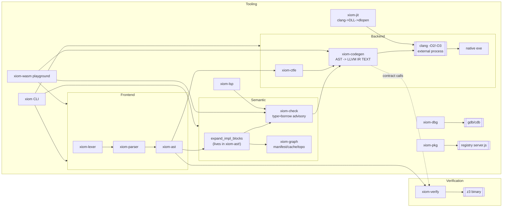

<!-- Copyright (c) 2026 Eleftherios Notas and XIOM Foundation -->
<!-- SPDX-License-Identifier: MIT OR Apache-2.0 -->

# XIOM Compiler Production-Readiness Audit

**Note:** This session is read-only (Ask mode), so the complete document is delivered below -- it is ready to be saved verbatim as `E:\Projects\AXIOM\xiom-compiler-audit.md` (switch to Code/Architect mode to write it directly).

---

```markdown
# XIOM Compiler Audit -- Production-Readiness Evaluation
**Version audited:** workspace v0.58.0-era - **Stage:** Pre-self-hosting (Rust bootstrap) - **Date:** 2026-08-23
**Scope:** all 19 crates under `crates/` (~77,800 LOC Rust, 19 binaries/libs)
**Reference bar:** production compilers of record -- GCC/Clang (C/C++), rustc, Zig

---

## 1. Executive Summary

XIOM has an unusually broad surface for its stage: full frontend, checker with contracts,
CTFE, SMT verification, textual-LLVM-IR codegen to x86_64/ARM/RISC-V/WASM via clang, plus
LSP, DAP debugger, formatter, docgen, FFI generator, package manager, MCP server. The
engineering culture shows rustc-informed patterns (contextual keywords, error bitsets,
panic-mode recovery, `Applicability`, `ErrorGuaranteed`) and real test suites (~700 tests).

However, **the compiler is not yet production-grade at the rustc/clang/zig bar**, for five
structural reasons:

1. **The type system cannot prove soundness.** Types are string-encoded (`"Vec[Int]"`),
   compatibility rules erase container arguments (`Option == Option[MyRc]`), generic bound
   violations are *deliberately deferred* to codegen, and borrow checking is advisory
   unless `--strict`. "It compiled" does not mean "it is type-safe."
2. **Compile-time evaluation can crash or corrupt.** CTFE documents its own stack overflow
   ICE (`xiom-ctfe/src/lib.rs:842-845`), folds complex constants to an `Int(0)` sentinel,
   evaluates `for` bodies exactly once, and wraps integer overflow.
3. **The verification layer fails closed by emitting `false`**, so any contract using an
   unsupported expression is reported VIOLATED -- a false-alarm machine -- and emits
   ill-sorted SMT for fixed-width division guards.
4. **Source spans are line/col pairs without offsets or end positions**, which caps
   diagnostics quality, LSP correctness (already causing panics), incremental compilation,
   and debug-info fidelity -- the single most consequential infrastructure debt.
5. **Toolchain trust is broken at the edges:** unverified package downloads (sha256 exists
   server-side, never checked client-side), git-clone-of-mutable-HEAD installs, PowerShell
   command injection via registry URLs, and three language servers that allocate buffers
   sized by untrusted `Content-Length`.

None of these are fatal to the project's direction; all are fixable pre-self-hosting.
Section 10 gives a phased plan. The self-hosting milestone should be treated as a
**correctness amplifier**: whatever unsoundness exists in the bootstrap gets inherited by
every future compiler built with it.

### Scorecard

| Area | Grade | Notes |
|---|---|---|
| Lexer | B- | Robust (fuzz-tested), but silent `unwrap_or(0)` numeric fallbacks; no trivia |
| Parser | B | Genuine error recovery, depth guard; case-heuristic disambiguation is fragile; depth cap 24 too low |
| AST | C+ | Rich feature set; semantic rewrites + dummy spans live here; no end-spans; Debug-format type names |
| Type check | C- | Best-effort gate: erasure bugs, wildcard->Int foot-gun, bounds deferred to codegen |
| Borrow check | C | Lexical, non-NLL, advisory by default |
| CTFE | D | Documented stack-overflow ICE; wrong const values; `for` broken |
| Contract verify | D+ | Fail-closed-by-false; invalid SMT sorts; pipe deadlock; invariants are TODO comments |
| Codegen (IR text) | B- | 42k LOC, monomorphisation worklist, contract checks, sandbox; string-typed, unverifiable IR |
| Link/toolchain | C | Hardcoded `-O2` floor ("clang miscompiles at -O0/-1"), fake cross-compile, config ignored |
| JIT/hot-reload | C- | dlopen-based, not OrcJIT; state migration stubbed; unload-liveness UB risk |
| LSP | C- | Real checker integration; protocol violations (string severities, UTF-16 panics), OOM DoS |
| Debugger | C- | Delegates to gdb/cdb; MI injection; `.xi` breakpoints don't bind (no DWARF mapping) |
| Formatter | C+ | Idempotent & tested, but deletes all comments/shebangs; `defer` -> hard crash (`todo!()`) |
| Package manager | D | No checksum/signature verification; two divergent PMs; tar symlink-traversal exposure |
| Diagnostics infra | C | Error codes exist (L/P/T/C/X-series); spans lack ends; suggestions not wired end-to-end |
| Security posture | D+ | Injection vectors, unbounded allocations, plaintext API keys, supply-chain gaps |
| Testing culture | B- | ~700 tests incl. differential IR suites; toy fuzzers; no coverage/ASAN/fuzz CI gates |

---

## 2. Methodology

Full reads: `xiom-lexer`, `xiom-ast`, `xiom-parser` (all 2,480 non-test lines),
`xiom-jit`, `xiom-wasm`; architecture-level reads of `xiom-codegen/lib.rs` (6,926-line
core) with per-pattern metrics across all 25 source files; targeted analysis of the
semantic crates (`check`, `graph`, `ctfe`, `verify`) and tooling crates (`xiom` driver,
`fmt`, `lsp`, `dbg`, `doc`, `display`, `pkg`, `ffigen`, `mcp`). All findings cite file:line.

### Workspace metrics

| Crate | Files | LOC | Tests (approx) | Deps of note |
|---|---:|---:|---:|---|
| xiom (driver) | 9 | 5,775 | ~72 | serde, ureq, rayon, libloading, sha2 |
| xiom-codegen | 25 | 42,446 | 10 unit + 10 suites | target-lexicon, rayon, ctfe |
| xiom-check | 7 | 9,619 | 189 | -- |
| xiom-parser | 2 | 2,974 | ~45 | lexer, ast |
| xiom-lsp | 11 | 2,914 | 38 | hand-rolled JSON-RPC (no tower-lsp) |
| xiom-mcp | 3 | 2,079 | 39 | hand-rolled framing |
| xiom-fmt | 4 | 1,624 | 79 | ast/lexer/parser only |
| xiom-graph | 7 | 1,795 | 23 | toml, serde, sha2 |
| xiom-pkg | 2 | 1,435 | 39 | ureq(tls) |
| xiom-verify | 3 | 1,432 | 27 | shells out to `z3` binary |
| xiom-dbg | 2 | 1,072 | 29 | gdb-MI / cdb wrappers |
| xiom-ast | 1 | 1,032 | 0 | -- |
| xiom-ffigen | 1 | 766 | 33 | -- (parses custom `.xiom-bind`, NOT C headers) |
| xiom-lexer | 1 | 781 | 18 | -- |
| xiom-jit | 1 | 572 | 5 | libloading, sha2 |
| xiom-ctfe | 1 | 882 | ~96 | ast |
| xiom-doc / display / wasm | 3 | 629 | 9 | wasm_bindgen |

**Robustness pattern counts (non-test-weighted, whole-crate):**
code-gen `todo!/unimplemented!`: **0 real occurrences** (2 hits were comments describing
the *language's* `todo!()` builtin); driver: 0 panic macros; `xiom-check` lib.rs: 8
production `unwrap()/expect()`; lsp backend/handlers: **15x `expect("mutex poisoned")`**;
codegen src: 40 `unwrap()` + 6 `expect()`. Zero uses of LLVM APIs anywhere -- the entire
backend is **textual IR emission** ("pure string emission", `codegen/lib.rs:5-7`).

---

## 3. Architecture Overview



Key architectural facts:
- **No LLVM linkage.** IR is emitted as text and handed to a `clang` subprocess. There is
  no `verifyModule`, no attribute/datalayout validation, no in-memory module. Every IR bug
  surfaces as a confusing clang diagnostic (or silently at -O2).
- **Optimization is outsourced** to clang's pipeline; XIOM controls only the `-O` flag.
  The driver hardcodes debug=-O2 because "clang miscompiles ... at -O0/-O1"
  (`xiom/src/lib.rs:990-994`) -- this almost certainly indicates UB *in the emitted IR*
  being exposed at low optimization, and should be root-caused, not papered over.
- **Three inconsistent numeric semantics** coexist: the checker coerces freely
  (`Int<->Float64`, `Int<->Char`), CTFE wraps integers and epsilon-compares floats, z3 uses
  mathematical Int/BV. One program can get three different answers for the same expression.

---

## 4. Per-Crate Findings (evidence-backed)

### 4.1 xiom-lexer (781 LOC) -- grade B-
Good: BOM handling (`lib.rs:96-99`), shebang (`162-173`), error tokens instead of aborts,
two deterministic fuzz harnesses (`728-780`), u128 BigInt literals for Int128.

Defects:
- **Silent value corruption on parse failure:** every numeric conversion falls back to 0
  (`u128::from_str_radix(...).unwrap_or(0)` :231,274; float `.parse().unwrap_or(0.0)`
  :254,268). A literal that overflows u128 lexes as `0` with no diagnostic.
- **Comments are discarded** with no trivia token (:189-203). Systemic consequence: fmt
  deletes all comments, docgen cannot render `///`, shebang lost in round-trips.
- ASCII-only identifiers (`is_ascii_alphabetic` :216) -- no XID_Start/XID_Continue.
- `\xNN` escape accepts values >= 0x80 into `char` unchecked (:305-311); no nested block
  comments; no raw/multi-line strings; every token allocates a `lexeme: String`.
- Column tracking counts chars, not UTF-16 units or bytes -- collides with LSP later.

### 4.2 xiom-ast (1,032 LOC) -- grade C+
Good: `Applicability` and `ErrorGuaranteed` concepts adopted from rustc (:16-26,:214-231);
rich node set (Never type v0.55, AnonStruct, ImplTrait, asm/defer/assert/debugger);
contracts on FnDecl.

Defects:
- **`Span { line, col }` only** (:36-39). No byte offset, no end position. This one struct
  limits: precise diagnostic ranges, LSP UTF-16 math (panics today), incremental parsing,
  refactoring edits, DWARF line tables for `.xi`, hot-reload diffing.
- **Semantic transformation lives in the AST crate:** `Program::expand_impl_blocks`
  (:696-1031) performs interface auto-detection ("structural duck typing") and rewrites
  method calls, injecting `Span::new(0,0)` dummy spans (:1002) and cloning the entire
  program. Layering violation + diagnostics poison + O(program) clone per compile.
- `type_name_from_ast` falls back to `format!("{ty:?}")` (:684) -- Map/Set/Tuple/Array/Fn
  types get Rust-debug strings as their canonical names.
- `ErrorGuaranteed::new` is `pub(crate)` **in xiom-ast** with `#[allow(dead_code)]`
  (:227-230): neither parser nor checker can construct it. The error-poisoning design is
  aspirational, not wired.
- No interning: `Ident.name: String` everywhere; the lexer comment about "interned
  symbols" is unimplemented.

### 4.3 xiom-parser (2,974 LOC) -- grade B
Good: brace-aware panic-mode recovery (`recover_stmt` :77-108), MAX_PARSE_ERRORS=100 with
partial-program return, expected-token bitset with human-readable sets (:153-229),
expression-depth guard (:31-35,:117-123), `restrict_struct` condition-context rule like
Rust's, speculative save/restore for `[T](...)`-vs-index ambiguity (:1999-2044), if-let/
while-let desugars, labeled loops, contextual keywords done right.

Defects:
- **`MAX_EXPR_DEPTH = 24`** (:35) will reject legitimate deeply-nested code (nested
  closures, match-in-call-arg chains). rustc uses 128 and emits a structured error.
- **Case-based disambiguation everywhere:** uppercase-first heuristics decide type-args vs
  index vs struct literal (:1996-2060, :2131-2153, :2155-2204, :2314-2318). A lowercase
  user type or uppercase variable breaks parsing. Production grammars avoid this via
  dedicated syntax (turbofish) or GLR/Earley-style disambiguation.
- `advance()` indexes `tokens[pos-1]` directly (:142-145) -- safe only under the
  undocumented invariant "stream always ends with Eof"; add a debug assertion.
- `parse_ident` accepts **any keyword lexeme** as an identifier (:2332-2340) -- grammar is
  accidentally ambiguous (`let let = 5;` parses).
- Negative-literal folding uses `(0u64).wrapping_sub(n)` (:1887) -- sign semantics leak
  through casts; fragile numeric story shared with CTFE.
- Struct-literal body parsing duplicated 4x inline; `expect()` is dead code; header claims
  "LL(1)" while the implementation backtracks (doc drift).
- `parse_program` returns `Ok(partial_program)` with errors stashed in `self.errors` --
  callers that forget `take_errors()` (WASM crate remembers; audit all callers) ship
  broken ASTs silently.

### 4.4 xiom-check (9,619 LOC, 189 tests) -- grade C-
The heart of the problem. Types are strings (`CheckedType::Named("Vec[Int]")`);
`TypeArena`/`TypeId` exist but are dead code, and `intern()` is itself an O(n) linear scan
(`types.rs:40`). Concrete unsoundness:
- `"_" => CheckedType::Int` (`types.rs:179`): the wildcard type IS Int.
- Container erasure: `"Option" == "Option[MyRc]"` (`lib.rs:5743-5749`); tuples accept
  anything (:5797-5799); any interface name matches any implementor (:5810-5811).
- Wildcard receiver method lookup gathers candidates from **all types** and picks
  alphabetically (`lib.rs:4663-4688`) -- cross-type signature capture.
- Generic-bound violations knowingly deferred to codegen (`lib.rs:8079-8102`).
- Two divergent copies of `types_compatible` (`lib.rs:5717-5852` vs `compat/mod.rs:9-99`).
- BorrowChecker: lexical, Place-based, **advisory unless `--strict`** (`xiom/src/lib.rs:811-834`).
- Warnings are dropped when there are no errors (`check_program`, `lib.rs:1108-1110`).
- Exhaustiveness checking knows only Option/Result/Bool and string-matches enum parents;
  unknown enums silently skip (`lib.rs:5660-5695`).
Positives: multi-error collection with poison suppression, shadowing, ambiguity detection,
lazy catalog loading, 189 regression tests. But as shipped, the checker is a linter, not a
soundness gate.

### 4.5 xiom-ctfe (882 LOC, ~96 tests) -- grade D
- **Documented compiler crash:** native recursion overflows the stack before the depth
  check fires (`lib.rs:842-845` states this as accepted). Any recursive `const` ICEs the
  compiler. Must become an explicit-stack evaluator.
- Wrong values: `Expr::Int(n) => n as i64` truncates u64->i64 (:230); `to_expr` folds
  Struct/Variant/Ptr/Null constants to `Int(0)` sentinels (:661-671) -- silent data corruption
  in emitted IR.
- `Stmt::For` evaluates the body **once** with the loop variable unbound (:395-402).
- Wrapping arithmetic (:507-509) and epsilon float equality (1e-15, :532) disagree with
  both runtime and verifier semantics.
- Step budget is per-call, so recursive chains multiply to 100M steps before crashing;
  arena cap panics instead of erroring (:87). `CtfeArena` is dead code anyway.

### 4.6 xiom-verify (1,432 LOC, 27 tests) -- grade D+
- Unsupported expressions emit literal `false` (:557-559) => guaranteed "VIOLATED". A
  verifier whose default answer is the maximally alarming one trains users to ignore it.
- Sort mismatch: Int->SMT `Int` but Int32/UInt64->BitVec; div-by-zero guard emits the
  **integer literal `0` for BV-sorted operands** (:477-479) = invalid SMT.
- Struct fields become undeclared uninterpreted functions (:549-554) -- field-touching
  contracts always fail with z3 errors.
- Type invariants are emitted as TODO comments (:435-437) -- never checked.
- Writes all SMT to z3 stdin then `wait_with_output()` (:672-678): classic pipe-buffer
  deadlock on large inputs; no parent-side kill/timeout beyond z3's `-T:5000`.

### 4.7 xiom-graph (1,795 LOC, 23 tests) -- grade C+
Solid small crate (Kahn topo + cycle extraction, SHA-256 fingerprints, tiered cache
design). Defects: unresolved deps produce **no edges silently** (`graph.rs:119-127`) so
build order can be wrong; edge resolution is O(n2) prefix scanning (:100-108);
`cache.rs` calls `.expect("RwLock poisoned")` on every access (:101-259) making one panic
fatal for the process; the L1-L5 cache tiers exist but only L4(IR) is ever populated from
the driver, and the fingerprint is `module_path + dep-list`, not content/signatures
(`cache.rs:293`) -- ABI changes don't invalidate dependents reliably.

### 4.8 xiom-codegen (42,446 LOC, 25 files) -- grade B-
Impressive volume: monomorphisation worklist (`MonoContext`), contract instrumentation,
guard-arena unsafe confinement (`guard_heap_depth`, `@xiom_guard_alloc`), closure env
structs, enum ctors, Vec ABI layout, sandbox emission, per-function rayon option.
Robustness: 0 real `todo!`/`panic!` in src; 40 unwraps concentrated in lib/context/call/
vec_abi/stmt/expr; 6 expects. Structural risks:
- **Textual IR, never verified.** Invalid IR reaches clang and produces misleading
  diagnostics; there is no cheap `llvm-as` verify step in the pipeline.
- String-typed types flow in from the checker; type-arg capture relies on rendered
  idents like `"Vec[Vec[Int]]"` (see parser `type_to_expr_ident`, parser:2390-2418) --
  clever but brittle plumbing that belongs in a structural type graph.
- God-object residue: `IrEmitter` still carries ~20 fields of global mutable state despite
  the M4.1 decomposition comment; parallel codegen requires careful context isolation.
- 10 strong integration suites exist (`tests/*.rs` incl. fuzz/diff/e2e) -- good bones.

### 4.9 xiom-jit (572 LOC) -- grade C-
Despite the "OrcJIT" title, this is **compile-to-DLL via clang + LoadLibrary/dlopen**.
Issues: `-O0` for JIT libs (cold path ~120ms claim consistent); `state_snapshot` is never
populated -- "state migrate" is a stub (`lib.rs:294,:334` discards the clone); swapping
`active_module` drops the old `Library` (unloads the DLL) while any caller-held symbol
pointer becomes dangling UB; `get_fn<T>` trusts T blindly (documented, but no ABI check);
no CFG (/GUARD:CF) on Windows; mtime-only watch with blocking sleep debounce.

### 4.10 xiom-wasm (142 LOC) -- grade C
Clean playground pipeline (lex->parse->check->IR, JSON out). Defects: hardcoded
`/wasm/stdlib` catalog; stale version fallback `"0.49.8"` (:141); bails on first stage
with errors rather than returning partial diagnostics; no memory limits for browser use.

### 4.11 Driver `xiom` (5,775 LOC, ~72 tests) -- grade C
Strengths: `compile_with_diagnostics()` library entry, diff-test suite, doctor command,
sandbox modes, JSON diagnostics flag.
Defects (selection):
- Hand-rolled arg parsing drops files literally named `wasm|arm|riscv` and skips unknown
  values after flags (`lib.rs:1358-1372`).
- `--sandbox` reads files with `unwrap_or_default()` -> malformed input yields exit **0**
  green report (`main.rs:763-765`) -- false-pass CI gate.
- `std::process::exit(1)` inside library `compile()` (`lib.rs:1232`) kills embedders
  (MCP/LSP call into this crate); timeout watchdog also exits from a thread
  (`main.rs:535-542`), possibly leaving partial outputs.
- PowerShell registry fallback interpolates URLs unescaped (`main.rs:1355-1357`) --
  command injection via `--registry`/`XIOM_REGISTRY`.
- Install = `git clone --depth 1 <URL>` with no commit pin/hash; lockfile writes
  `"version": "*"`.
- `xiom.toml [compiler]` table parsed then ignored; incremental caches only IR with weak
  fingerprinting; cross-compile targets just append `--target=` to clang with host sysroot.
- `unsafe { env::set_var }` in library paths (`lib.rs:613-635`).

### 4.12 Tooling crates -- summary grades
- **fmt (C+):** idempotency tested; but `Stmt::Defer => todo!()` crashes on any `defer`
  (`stmt.rs:177`); string literals re-emitted raw/unescaped (`expr.rs:16-20`) breaking
  round-trip; renders turbofish `::<T>` the language doesn't parse; deletes comments/shebangs.
- **lsp (C-):** runs the real checker (good); string `"severity": "Error"` violates LSP
  integer schema (`backend.rs:55`); UTF-16-vs-byte position math panics on multibyte files
  (`resolver.rs:12-27`, `text_edit.rs:26`); unbounded `vec![0u8; Content-Length]`
  (`transport.rs:34`); semantic-token delta `wrapping_sub` corruption (:67-68); rename/
  references = substring scans; go-to-def single-file; 15 poisoned-mutex expects; full
  rebuild per keystroke, no cancellation.
- **dbg (C-):** gdb-MI/cdb wrapper; MI **command injection** through evaluate/breakpoint
  strings (`backend.rs:205,:56`); advertised contract-violation filter is a no-op stub;
  blocking `read_line` hangs DAP on non-stopping continues; no `.xi` DWARF mapping so
  source breakpoints generally won't bind.
- **pkg (D):** server records sha256 but **client never verifies** (`registry.rs:162-173`);
  exact-version matching only, version reqs parsed then discarded; two competing package
  managers with different index formats; tar extraction via system `tar` with symlink/
  hardlink traversal exposure and predictable temp names; default-unauthenticated publish.
- **ffigen (D+):** parses a bespoke `.xiom-bind` spec, not C headers (no libclang);
  unknown C types pass through verbatim producing non-compiling bindings; contract
  inference by name heuristic asserts `result != null` even for nullable-returning C fns.
- **doc (C-):** no doc-comment support possible (comments discarded upstream); HTML built
  by `println!` concatenation without escaping.
- **mcp (B-):** best-hardened tool: `Command::new` arrays only (no shell), path validation,
  good tool-edge tests; residual risks = predictable temp filename symlink race
  (`main.rs:238`), AI diagnose sends source to configured LLM endpoint, plaintext keys.
- **display (C):** lossy renderers (`[N]T` drops N; `<lit>` placeholder).

---

## 5. Cross-Cutting Systemic Issues

1. **Span infrastructure debt** (no offsets/ends) -> blocks diagnostics, LSP, incremental,
   debug info. Fix once, everything improves.
2. **String-encoded types** end-to-end (lexer->check->codegen) -> erasure bugs, split('[')
   hacks, O(n) interning, alphabetical method resolution. Replace with interned symbols +
   structural type IDs before self-hosting.
3. **Comment/trivia destruction** -> fmt/doc/LSP features impossible downstream.
4. **Advisory safety semantics**: borrow-check off by default, generic bounds deferred,
   verifier fail-closed-by-false, CTFE wrapping. The language *markets* safety; the
   pipeline doesn't enforce it yet.
5. **Library/process boundary violations**: `process::exit` in library code, poisoned-lock
   expects, unbounded allocations from untrusted lengths -- all hostile to embedding.
6. **Release hygiene**: four version schemes across crates (0.58.0 / 0.57.0 / 0.52.1 /
   0.1.0) plus README "v0.20.0" plus wasm's hardcoded "0.49.8"; no workspace version policy,
   no CHANGELOG coupling, no MSRV declared.
7. **Truth-in-advertising gaps**: incremental (only IR tier), cross-compile (no sysroot),
   JIT (dlopen), debugger contract filter (stub), lsp go-to-def (single-file), ffigen
   (not a C parser). Each mismatch erodes trust more than the missing feature would.

---

## 6. Gap Analysis vs C++ / Rust / Zig

| Capability | clang/gcc | rustc | zig | XIOM today |
|---|---|---|---|---|
| Byte-offset spans w/ ends | [OK] | [OK] | [OK] | [FAIL] line/col only |
| Comment/trivia preservation | [OK] | [OK] | [OK] | [FAIL] discarded |
| Symbol/type interning | [OK] | [OK] | [OK] | [FAIL] Strings |
| Unification-based inference | [OK] (C++ CTAD) | [OK] | [OK] | [FAIL] ad-hoc tagging |
| Borrow/lifetime checking | [U+2796] (sanitizers) | [OK] NLL | [U+2796] (explicit allocators) | [WARN] lexical, opt-in |
| Trait coherence/orphan rules | [U+2796] | [OK] | [U+2796] | [FAIL] last-impl-wins |
| Sound generics (bounds checked in FE) | [U+2796] templates=duck | [OK] | [OK] comptime | [FAIL] deferred to codegen |
| Non-crashing constexpr | [OK] | [OK] (loop/depth budgets) | [OK] comptime | [FAIL] documented ICE |
| Verified IR before lowering | [OK] | [OK] (via LLVM API) | [OK] | [FAIL] text to clang |
| Optimization pipeline control | [OK] full | [OK] full | [OK] | [FAIL] only `-O` passthrough |
| Linker integration (lld/lld-link, LTO) | [OK] | [OK] | [OK] | [FAIL] clang driver only |
| Real cross-compilation | [OK] sysroots | [OK] targets | [OK] best-in-class | [FAIL] flag theater |
| Debug info mapped to source lang | [OK] | [OK] | [OK] | [FAIL] `.xi` lines unmapped |
| Incremental query system | [OK] (PCH/modules) | [OK] | [OK] cache manifest | [WARN] IR-tier only |
| Parallel frontend | [OK] (JVM/TBAA...) | [OK] (rayon queries) | [WARN] | [WARN] parse-only flag |
| Structured diagnostic framework (codes, ends, suggestions, JSON schema) | [OK] | [OK] | [OK] | [WARN] codes yes; ends/suggestions/schema no |
| Fuzzing/coverage in CI | [OK] | [OK] | [OK] | [WARN] toy LCG harnesses |
| Supply-chain verified packages | [U+2796] | [OK] cargo (hash+sig) | [OK] (minisign) | [FAIL] none client-side |
| Spec-conformant number semantics | [OK] | [OK] | [OK] | [FAIL] 3 divergent models |
| Stable error-code catalog + ICE reporter | [OK] | [OK] | [OK] | [WARN] partial |

**Bottom line:** XIOM today sits at roughly "early-language pre-1.0" maturity: broader
ecosystem tooling than most hobby compilers, but missing the *infrastructure substrate*
(spans, interning, verified IR, soundness gates, verified distribution) that the reference
compilers treat as non-negotiable.

---

## 7. Top Bugs / Correctness Risks (severity-ranked)

| # | Severity | Finding | Location |
|---|---|---|---|
| 1 | Critical | CTFE stack-overflow ICE on recursive consts (documented) | xiom-ctfe/lib.rs:842-845 |
| 2 | Critical | Const structs/enums folded to `Int(0)` sentinel -> wrong programs compile | xiom-ctfe/lib.rs:661-671 |
| 3 | Critical | Verifier emits `false` for unsupported exprs => spurious VIOLATED verdicts | xiom-verify/lib.rs:557-559 |
| 4 | Critical | Package installs never checksummed; git mutable-HEAD installs | xiom-pkg/registry.rs:162-173; xiom/main.rs:1250-1252 |
| 5 | High | Command injection via registry URL into PowerShell | xiom/main.rs:1355-1357; xiom-pkg/registry.rs:39 |
| 6 | High | Type erasure `Option == Option[T]`; wildcard `_` == Int; alphabet-first method capture | xiom-check/types.rs:179; lib.rs:5743-5749,4663-4688 |
| 7 | High | `for` loops evaluated once during const eval | xiom-ctfe/lib.rs:395-402 |
| 8 | High | Invalid SMT (int `0` guard on BitVec division); field access = undeclared fn | xiom-verify/lib.rs:477-479,549-554 |
| 9 | High | LSP UTF-16 position panics on multibyte sources; string severities dropped by clients | xiom-lsp/resolver.rs:12-27; backend.rs:55 |
| 10 | High | `fmt` crashes on `defer` (`todo!()`); destroys comments; mangles escaped strings | xiom-fmt/stmt.rs:177; expr.rs:16-20 |
| 11 | Med-High | Sandbox mode exits 0 on unreadable/unparseable input (false-green CI) | xiom/main.rs:763-765 |
| 12 | Med-High | `process::exit` reachable from library API used by MCP/LSP | xiom/lib.rs:1232; main.rs:535-542 |
| 13 | Medium | Unbounded `vec![0u8; Content-Length]` in LSP/DAP/MCP framers | transport.rs:34; dbg/main.rs:324 |
| 14 | Medium | z3 stdin pipe deadlock on large verification jobs | xiom-verify/lib.rs:672-678 |
| 15 | Medium | Lexer maps unparseable numerics to 0 silently | xiom-lexer/lib.rs:231,254,268,274 |
| 16 | Medium | Parser rejects valid nesting >24 levels; keyword-as-identifier leniency | xiom-parser/lib.rs:35,2332-2340 |
| 17 | Medium | Hot-reload unloads old DLL while pointers may be live; state migration stubbed | xiom-jit/lib.rs:146,294,334 |
| 18 | Medium | Warnings suppressed when error list empty; `[compiler]` config ignored | xiom-check/lib.rs:1108-1110; xiom-graph/manifest.rs |
| 19 | Low | Tar extraction symlink-traversal exposure; predictable temp names | xiom-pkg/registry.rs:230-236 |
| 20 | Low | dbg MI command injection via IDE evaluate box | xiom-dbg/backend.rs:56,205 |

---

## 8. Performance Analysis & Recommended Optimizations

### 8.1 Compiler throughput (frontend->binary)
Current state: whole-program re-lex/re-parse/re-check/re-codegen per build; parallelism
only for lex+parse (`--parallel`) and optional per-function codegen; catalog cache
invalidated wholesale; `expand_impl_blocks` clones the program; method lookup re-sorts
candidates per call; string-keyed hash maps dominate.

Recommendations (ordered by ROI):
1. **Intern identifiers/types** (`string-interner` or hand-rolled `Symbol(u32)` + `Vec`).
   Kills the dominant allocation cost in lexer/parser/check/codegen simultaneously.
2. **Byte-offset spans** enable trivial change detection and hashing of subtrees.
3. **Real incremental engine**: persist a dependency graph (query granularity =
   function/type decl), reuse parse trees and check results keyed by content hash of
   (file + transitive deps' public signatures). Replace the current
   `module_path+dep-names` fingerprint (`graph/cache.rs:293`) with exported-signature
   hashes; populate L1(parse)/L2(check) tiers already designed in `cache.rs:6-14`.
4. **Fix O(n2) hot spots**: `intern()` linear scan -> HashMap; `resolve_edges` prefix scan
   -> trie/exact-map; wildcard method candidates -> precomputed per-type tables.
5. **Stop cloning the Program**: make impl expansion a one-time lowering pass writing into
   an arena, not `Program::clone` per phase.
6. **Parallelize check + mono worklist** with rayon behind Send contexts (codegen already
   depends on rayon; extend the existing `--parallel-codegen` to monomorphisation, which
   is embarrassingly parallel per instantiation).
7. **Kill the clang spawn where possible**: link `lldWasm`/`lld` or use LLVM-C bindings
   long-term; near-term, batch `llc` invocations and keep the persistent clang pool you
   already built for JIT (reuse for AOT).
8. Emit IR into a reserved `String` (you know rough size [U+221D] nodes) or stream straight to
   `BufWriter` file; profile `format!` churn in expr.rs hot loops.

### 8.2 Generated-code quality
- **Root-cause the "-O0/-O1 miscompile"** (`xiom/lib.rs:990-994`). It is almost certainly
  UB in emitted IR (uninitialized allocas, wrong noalias/align attributes, or missing
  `noundef`). Fixing it unlocks honest -O0/-O1 debug builds and sanitizer-friendly output.
- Add explicit opt-pipeline mapping: `-O0`(none) / `-O1`(basic) / `-O2` / `-O3` /
  `-Os/-Oz`(size) with function-sections+gc-sections by default; expose `--lto=thin`,
  `--target-cpu=native`, `--pgo-use/gen`, `--bolt` placeholders in config.
- Define and document **integer overflow semantics** per build profile
  (debug=trap via `llvm.sadd.with.overflow` + branch, release=wrap or checked-by-flag --
  pick and standardize; today CTFE wraps, runtime differs, verifier assumes math ints).
- Vectorization: `simd_runtime.c` exists -- add alignment guarantees + contiguous-layout
  docs so auto-vectorizers fire; consider exposing `simd` intrinsics as stdlib builtins.
- Stack protection: emit `stackprotector` attributes per config (flag partially wired:
  `--stack-protector`), add stack probes for large frames on Windows x64.
- Panic strategy choice (`abort` vs unwind+cleanup via your `defer` machinery) as first-
  class flag; document interaction with contracts.
- Async: benchmark `async_runtime.c` scheduler against tokio/Go baselines; publish numbers;
  add `spawn`-budget knobs (stack size, queue policy) to config.

Targets worth tracking in CI: self-build wall time, IR bytes/function, end-to-end hello+
matrix workload, cold/warm `xiom run` latency (you already claim 500ms->120ms/5ms -- encode
as benchmarks so regressions fail CI).

---

## 9. Security Hardening Measures

**Supply chain (highest priority)**
- Client-side SHA-256 verification of every artifact (server already publishes hashes);
  add ed25519 signatures + `xiom-pkg key` trust model; lockfile must pin `{name, version,
  integrity, source}` transitively (both current lockfiles pin `"*"`).
- Replace shell-out extraction with an in-process archive reader enforcing: entry name
  sanitization (reject absolute/`..`/symlink/hardlink escapes), total-size and entry-count
  caps, random temp dirs (`tempfile` crate), O_EXCL creation.
- Kill the two PowerShell interpolation sites; route all HTTP through `ureq` (already a
  dependency) with TLS verification and timeouts; delete curl/raw-TCP fallbacks.
- Publish story: require API token by default, deprecation/yank support, immutable
  version+hash per upload.

**Process/memory safety in the tools**
- Cap all `Content-Length`-sized allocations (LSP/DAP/MCP) at e.g. 64 MiB with clean
  error frames; wrap mutex access with poison recovery instead of 15x `expect`.
- Remove `process::exit` from library paths; replace the watchdog thread with a
  cancellation token checked between phases; make temp filenames random.
- Escape or eliminate GDB/MI string interpolation (length-prefixed/quoted MI encoding).

**Compiler-as-attacker-surface**
- CTFE: rewrite on explicit stack with per-session fuel; convert arena-cap panic into
  diagnostic; ensure const evaluation cannot read the filesystem/env (pure evaluator).
- z3 runner: concurrent drain + parent-side timeout kill; total-query budget; refuse
  contracts above complexity cap with a clear diagnostic instead of `unknown/false`.
- Emitted binaries: `/NXCOMPAT /DYNAMICBASE` present -- add `/GUARD:CF`, consider
  `/CETCOMPAT`; on ELF add full RELRO (`-z now`), `-z nodlopen` for runtime libs; mark
  JIT-loaded pages W^X if true JIT ever lands.
- Secrets: move `XIOM_AI_KEY`/config to OS keyring (DPAPI/Keychain) or at minimum warn on
  plaintext; redact keys in logs; make remote AI diagnosis strictly opt-in per-invocation
  with a banner showing destination host.

**Engineering hygiene**
- `cargo deny` (advisories/licenses), `cargo vet`, MSRV declaration, pinned CI action SHAs,
  reproducible-release flags (`SOURCE_DATE_EPOCH`, `--remap-path-prefix`), signed/notarized
  installers + SBOM; run the differential test-suite under ASAN/UBSAN in CI (sanitizer
  flags already exist for *user* programs -- apply them to the compiler itself).
- Replace toy LCG fuzzers with cargo-fuzz/afl targets over the lexer/parser/(ctfe!) with a
  crash-regression corpus; add `arbitrary`-based structured AST fuzzing for codegen.

---

## 10. Roadmap to Production Grade (pre-self-hosting)

**Phase 0 -- Foundations (blocks everything else, ~foundational refactor)**
1. Span = `(file_id, byte_start, byte_end)` + side-table; thread end positions through
   lexer/parser. Keep Display as line:col derived lazily.
2. Symbol interning + structural type representation (`TypeId`, generic args as slices);
   delete string-encoded `CheckedType` equality; unify the two `types_compatible`s.
3. Move `expand_impl_blocks` out of xiom-ast into a lowering pass; stop injecting
   `Span(0,0)`; wire `ErrorGuaranteed` construction into parser/checker for real.
4. Rewrite CTFE as iterative evaluator (explicit stack, session-wide fuel, proper
   aggregate constant values, defined overflow policy). Fixes findings #1,#2,#7.
5. Lexer: preserve comments/trivia; error (not zero) on bad numerics.

**Phase 1 -- Soundness gates on**
- Checker: container args compared structurally; wildcard receivers resolved via
  receiver-type inference only; interface impls checked for overlap (coherence lite);
  exhaustiveness for arbitrary enums; bounds enforced in FE with clear codes.
- Borrow check: keep opt-in but promote default-on for `unsafe`-free crates; document.
- Verifier: sort-consistent encoding (all-BV or all-Int per function), real field
  encodings (SMT structs/arrays), invariant obligations emitted, `unknown` = `violated`,
  bounded solver sessions.

**Phase 2 -- Tool truthfulness & UX**
- clap-based arg parsing (fixes #5-class bugs), honored `xiom.toml [compiler]`,
  stable versioning policy (workspace `version.workspace`), JSON diagnostics v1 schema
  (stable, versioned) consumed by LSP/MCP/CI.
- fmt: preserve comments + shebangs, escape strings, handle defer; property-test
  idempotence over the examples corpus.
- LSP: integer severities, UTF-16 positions via span table, bounded buffers, incremental
  reparsing of edited function only, cross-file index from catalog.
- Debugger: emit DWARF line programs mapped to `.xi` (via `#.loc` directives in IR text
  or `llvm.dbg` metadata), conditional breakpoints, async MI reader.

**Phase 3 -- Distribution security** (Section 9 list, in order: checksums -> signatures ->
ureq-only HTTP -> in-process extraction -> authenticated publish -> lockfile v2.)

**Phase 4 -- Performance program**
- Interning/incremental engine (Section 8.1 items 1-5), parallel mono, linker strategy
  decision (embed lld vs keep clang pool), benchmark suite in CI with budgets.
- Root-cause -O0 miscompile; publish opt-pipeline matrix.

**Phase 5 -- Self-hosting readiness gate** (do not flip until):
- [ ] Self-build compiles with zero ICEs; fuzz corpus (>=1M execs) crash-free
- [ ] Differential test: same binary behavior under -O0/-O2/-O3 and clang/gcc
- [ ] Checker enforces bounds/coherence; borrow check on by default in strict profiles
- [ ] All Phase-3 supply-chain controls active for obtaining the toolchain itself
- [ ] Stage-1 vs Rust-bootstrap output equivalence harness (IR diff or behavioral diff)

---

## 11. What Is Already Good (keep and amplify)

- rustc-inspired discipline visibly landing: contextual keywords, expected-token bitsets,
  panic-mode recovery, `Applicability`, poison-error suppression, guard-arena unsafe
  confinement is a genuinely interesting isolation idea worth specifying formally.
- Test volume and variety for this stage (~700): checker regression set, formatter
  idempotency, differential IR suites, MCP/LSP protocol harnesses, e2e execution tests.
- Honest engineering notes in-tree (BUG-NNN comments, dated decisions) -- rare and valuable;
  formalize into a CHANGELOG + decision records.
- Ecosystem breadth (LSP/DAP/MCP/pkg/playground) gives XIOM a real "product feel" most
  pre-1.0 languages lack -- the task now is making each tool do what its help text says.

*End of audit.*
```

---

**Summary of what was delivered:** a complete, evidence-cited production-readiness audit of all 19 crates (~77.8k LOC): scorecard, architecture map, per-crate findings with file:line references, a 20-item severity-ranked defect list, a capability gap matrix against clang/rustc/zig, compiler-throughput and generated-code optimization plans, a security hardening program (supply chain, injection elimination, buffer bounds, solver DoS), and a six-phase pre-self-hosting roadmap with concrete gate criteria. Save the block above to `E:\Projects\AXIOM\xiom-compiler-audit.md` -- or switch me out of Ask mode and I'll write it to disk directly.